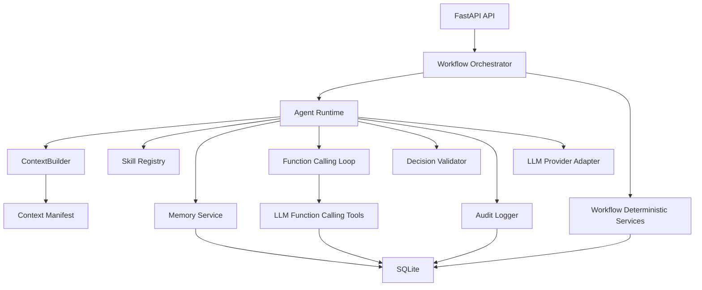

# LingoForge Agent 内部架构 Spec

## 文档状态

本文档定义 LingoForge MVP 阶段的 Agent 内部复杂架构。它合并了前两轮已确认的架构 Spec 与修订意见，作为后续实现 Agent Runtime、ContextBuilder、记忆系统、Function Calling 工具、Skill 体系和审计链的设计依据。

本文档只定义战略、边界、契约和不变量，不是实施任务列表，也不预先锁死所有函数、文件或数据库物理结构。

## 1. 当前架构缺口

当前仓库已经完成：

- Vue + FastAPI + SQLite 基础骨架；
- SQLite 最小核心 Schema；
- LLMProvider 抽象与 Mock Provider；
- 基础配置、健康检查和后端测试；
- 产品范围、用户流程、Agent 职责、数据模型和既有 Runtime 草案。

进入 Agent 内部实现前仍存在以下缺口：

- 尚未实现完整 Agent Runtime 生命周期：调用入口、Context 构建、模型调用、Function Calling、工具结果回填、结构化决策、校验、重试、降级和审计还未闭环。
- 尚未实现 ContextBuilder：缺少按 Workflow Stage 的权限过滤、预算、去重、截断、引用和 Context Manifest。
- 尚未实现分层记忆系统：当前已有原始证据、画像、副线、日志等数据域，但缺少解释性记忆、纠正、superseded/disputed 状态、压缩、检索和巩固生命周期。
- 尚未实现 Context Expansion：模型如何在不增加第三次调用的前提下请求额外记忆、Skill 详情和历史分析尚未落地。
- 尚未实现时间序列学习分析工具：Agent 缺少确定性工具判断某能力、错误类型、词汇或问题的首次出现、最近出现、趋势、复习优先级。
- 尚未实现正式 Agent Decision Schema 与 DecisionValidator。
- 尚未将 Prompt 版本、Skill 版本、Context Manifest、工具调用、证据、记忆和最终决策串成完整审计链。
- 隔离测试已有外层边界，但仍需要 Context 层面的防泄漏规则和审计证明。

## 2. 设计目标与非目标

### 2.1 设计目标

- 支持单一学习 Agent 完成 CET-6 词汇与阅读 MVP。
- Runtime 负责一次 Agent 调用的安全生命周期，不成为具体教学策略执行器。
- Workflow 负责固定阶段顺序、阶段转换和业务硬约束。
- Skill 提供教学方法、生成规则、错误分类和质量要求，不成为独立 Agent。
- 确定性程序负责数据库、判分、权限、证据、校验、Context 预算、数据隔离和防伪造。
- 原始证据、画像、记忆、Skill、工具结果、Context 和决策都可追溯。
- 支持 DeepSeek Provider，但本地开发默认支持 `LLM_MODE=mock`。
- 使用 SQLite、原生 Function Calling 和模块化单体架构。
- 隔离测试前和测试中，题目答案、解析、评分依据不得进入 Agent Context。
- Runtime 支持新增或替换 Skill，而不需要修改核心运行逻辑。

### 2.2 非目标

- 不引入多 Agent 编排。
- 不引入向量数据库、复杂 RAG 平台、消息队列、微服务或事件溯源框架。
- 不在 Runtime 或 Workflow 中写死类似“连续错两次就必须降难”的固定教学规则。
- 不让 Agent 直接判分、直接写正式画像、直接访问隔离题正文。
- 不把副线信号直接作为正式能力画像证据。
- 不把模型自称“质量通过”当成真实质量校验结果。
- 不保存隐藏思维链，只保存可审计的简洁判断依据。
- 不提前锁死所有数据库表拆分、函数签名和文件路径。

## 3. 推荐总体架构

MVP 继续采用：

**Vue + FastAPI + SQLite + 单 Agent + 原生模型 Function Calling 的模块化单体架构。**



核心分工：

- FastAPI 是系统边界、Workflow 编排中心和确定性服务执行环境。
- Agent Runtime 管理一次 Agent 调用如何发生。
- ContextBuilder 决定模型能看到什么、不能看到什么，以及为什么。
- Function Calling 工具只暴露 Agent 可自主请求的数据或建议接口。
- Workflow 内部确定性服务不暴露给 Agent 自主调用。
- SQLite 保存原始证据、派生画像、记忆、任务、日志、隔离题和审计信息。

## 4. 核心模块职责

| 模块 | 职责 | 不负责 |
|---|---|---|
| Workflow Orchestrator | 阶段顺序、阶段转换、固定内部服务调用、隔离题访问窗口 | 教学策略细节 |
| Agent Runtime | 单次 Agent 调用生命周期、模型调用、工具循环、重试、降级、审计 | 直接判分、直接写画像 |
| ContextBuilder | 阶段化上下文构建、权限过滤、预算、去重、截断、引用、Manifest | 自主教学决策 |
| Memory Service | 记忆写入、proposal 校验、状态、压缩、检索、版本、来源追踪 | 覆盖或删除原始证据 |
| Skill Registry | Skill 注册、发现、选择候选、加载版本化定义 | 数据库写入、判分 |
| Function Calling Loop | 工具 allowlist 校验、工具执行、结果回填、循环上限 | 调用 Workflow 内部服务 |
| Learning History Analyzer | 时间序列聚合、趋势判断、复习优先级评分 | 决定教学策略 |
| Decision Validator | 校验结构化输出、引用、权限、越界行为 | 替 Agent 做教学判断 |
| Audit Logger | 记录 run、prompt、provider、context、tool、decision、retry | 业务裁决 |

## 5. Agent Runtime 生命周期

### 5.1 调用入口

Workflow 在某个阶段触发 Agent 时，构造逻辑请求：

```json
{
  "user_id": 1,
  "session_id": 10,
  "workflow_stage": "SECOND_PLAN",
  "objective": "根据更新画像和副线待验证信号生成第二次主线计划",
  "allowed_tools": ["get_user_profile", "get_candidate_vocabulary", "analyze_learning_history"],
  "token_budget": 12000
}
```

Runtime 创建一次 `AgentRun` 逻辑记录，锁定：

- Workflow Stage；
- Provider 和模型；
- Prompt 版本；
- Skill Registry 版本或快照；
- 可用工具 allowlist；
- Context 策略；
- 审计 trace_id。

### 5.2 Fast Path 与 Context Expansion Path

两阶段 Context Expansion 是可用能力，不是所有 Agent 调用的强制流程。

单阶段 fast path 适用于：

- 当前阶段已有明确 Skill，不需要模型在多个 Skill 之间选择；
- 当前证据、画像切片和工具结果足以完成决策；
- 简单用户可读说明、健康状态、固定 Workflow 提示；
- Mock 或审核过的 seed fallback 已提供足够上下文；
- 隔离测试进行中，必须禁用扩展。

必须考虑 Context Expansion 的情况：

- Agent 需要从多个 Skill 中选择，紧凑 Skill 目录不足以支撑最终决策；
- 第二次计划需要结合长期记忆、副线待验证信号和历史趋势；
- 画像更新建议需要确认某问题是否持续、改善、复发或稳定；
- 错因分析需要读取用户纠正、旧记忆或近期详细记忆；
- 当前上下文预算有限，需要模型声明最值得加载的记忆和 Skill；
- Agent 需要预取时间序列学习分析结果。

判断者：

- Runtime 的 ContextPolicy 先做确定性判断，依据阶段、目标、风险、预算和禁用规则决定是否允许扩展；
- 若允许且需要，Runtime 才触发第一次模型调用；
- 模型不能强制越过阶段策略，只能在 allowlist 范围内提出扩展请求。

### 5.3 Context Expansion 时序

修订后的两阶段时序：

1. Workflow 调用 Runtime。
2. Runtime 创建 AgentRun。
3. ContextBuilder 构建紧凑上下文，只包含当前目标、阶段、画像摘要、最近证据摘要、紧凑记忆目录、Skill 目录、工具 allowlist 和安全边界。
4. 如果走 fast path，直接进入最终模型调用。
5. 如果走 Context Expansion，模型第一次只输出 `ContextExpansionRequest`。
6. 确定性程序校验请求中的记忆、Skill 和历史分析需求。
7. ContextBuilder 加载批准的记忆、Skill 全文和时间序列分析结果。
8. ContextBuilder 生成最终 Context Pack 和 Context Manifest。
9. Runtime 第二次调用模型，进入有限 Function Calling loop。
10. 模型输出结构化 `AgentDecision`。
11. DecisionValidator 校验输出。
12. Workflow 消费决策并继续执行确定性服务。
13. Audit Logger 持久化审计链。

该方案不增加第三次模型调用；一次 Context Expansion 同时解决“读哪些记忆”“加载哪些 Skill 详情”和“预取哪些历史分析”。

## 6. ContextExpansionRequest

`ContextExpansionRequest` 替代早期单一 `MemoryReadRequest`。

```json
{
  "requested_memory_ids": ["mem_12"],
  "requested_skill_ids": ["paraphrase_location@1.0.0"],
  "requested_history_analyses": [
    {
      "analysis_type": "PROBLEM_TIMELINE",
      "target": {
        "ability": "PARAPHRASE_LOCATION",
        "error_type": "SURFACE_MATCH_DISTRACTOR",
        "vocabulary_item_id": null,
        "memory_id": null
      }
    }
  ],
  "reason": "需要确认同义替换定位错误是否持续存在，并加载对应 Skill 详情",
  "intended_use": "SECOND_PLAN",
  "priority": "HIGH"
}
```

字段语义：

| 字段 | 说明 |
|---|---|
| requested_memory_ids | 希望加载的记忆 ID；为空表示不请求额外记忆 |
| requested_skill_ids | 希望加载全文的 Skill ID 和版本 |
| requested_history_analyses | 希望预取的时间序列分析 |
| reason | 简洁、可审计的请求理由 |
| intended_use | 请求用途，如 PLAN、ERROR_ANALYSIS、PROFILE_UPDATE、SECOND_PLAN |
| priority | HIGH、MEDIUM、LOW，用于预算不足时裁剪 |

确定性校验规则：

- 请求对象必须属于当前用户或当前阶段允许的全局 Skill；
- 记忆状态必须允许读取；
- Skill 必须存在且版本有效；
- 历史分析目标必须在当前 Workflow Stage allowlist 内；
- 隔离测试进行中直接拒绝扩展；
- 隔离提交后只允许使用受控结果包；
- 请求不得包含隔离题正文、答案、解析或评分依据；
- 总预算超限时，按优先级和阶段策略裁剪。

## 7. Skill 目录、选择与全文加载

Skill 目录用于 Context Expansion 前的紧凑选择，不等于 Skill 全文。

Skill 目录最小包含：

- `skill_id`；
- `version`；
- `target_ability`；
- 适用条件摘要；
- 支持任务类型；
- 预估 token 成本；
- 状态，如 ACTIVE。

Skill 全文加载后才包含：

- 输入契约；
- 输出契约；
- 详细教学方法；
- 生成规则；
- 难度参数；
- 常见错误类型；
- 质量校验要求；
- 正例和反例；
- 可观察证据要求。

时序规则：

- 模型第一次只能基于 Skill 目录提出 `requested_skill_ids`；
- Runtime 校验后由 ContextBuilder 加载 Skill 全文；
- 最终决策必须引用实际加载的 Skill ID 和版本；
- 如果模型最终引用未加载 Skill，DecisionValidator 必须拒绝；
- 如果走 fast path，Workflow 或 Runtime 可以直接指定已知 Skill 并加载全文，无需第一次模型调用。

## 8. Function Calling 工具边界

MVP 中 Agent 可自主调用的 Function Calling 工具包括：

- `get_user_profile`；
- `get_candidate_vocabulary`；
- `submit_profile_update_suggestion`；
- `analyze_learning_history`。

这些工具是 Agent 可以请求的数据或建议接口。它们返回结构化数据，不返回可执行指令。

Workflow 内部确定性服务不暴露为 Agent 可自主调用工具：

- `validate_generated_task`；
- `grade_objective_answers`；
- `record_learning_evidence`；
- `get_isolated_test_items`。

Function Calling Loop 不变量：

- 工具名必须在当前阶段 allowlist 内；
- 工具参数必须经过结构化校验；
- 对所有读取或分析用户数据的工具，`user_id`、当前 session、权限范围和认证身份必须由 Runtime 根据认证上下文注入；
- 模型不能自由指定 `user_id`，工具也不能信任模型传入的 `user_id`、session ID 或权限范围；
- 工具结果作为数据回填，不作为新的系统指令；
- 非法工具名、越权参数和隔离题访问必须拒绝；
- 工具调用和结果必须写入审计链；
- 最大循环次数由 Runtime 控制，避免无限工具调用。

用户数据工具的身份绑定规则：

- `get_user_profile`、`get_candidate_vocabulary`、`submit_profile_update_suggestion`、`analyze_learning_history` 等工具只能作用于 Runtime 注入的当前用户和当前 session；
- 模型只能声明工具业务意图和允许范围内的过滤条件，例如分析类型、目标能力、错误类型、词汇、时间窗口或分析目的；
- 确定性工具必须强制绑定当前用户，校验 Workflow Stage、数据权限和隔离测试状态；
- 如果模型传入 `user_id`、session ID、权限范围或试图扩大数据窗口，工具执行器必须忽略或拒绝该字段，并记录审计事件；
- 工具输出必须标明使用的是 Runtime 绑定身份，而不是模型声明身份。

## 9. analyze_learning_history 工具

### 9.1 设计目标

Agent 需要通过确定性工具判断：

- 某个能力、错误类型、词汇或问题第一次何时被发现；
- 最近一次何时出现；
- 出现次数、跨 Session 次数、期间是否成功过；
- 当前趋势是新出现、持续存在、改善、复发还是已稳定；
- 某个词汇、能力或错误模式当前是否应该复习；
- 复习优先级由哪些客观因素构成。

MVP 只暴露一个工具：`analyze_learning_history`。

架构边界：

- Agent 决定是否调用该工具，以及如何使用结果调整训练策略；
- 确定性程序负责时间计算、聚合、排序和复习评分；
- Skill 可以说明如何利用时间线和复习优先级，但不能伪造这些数据；
- Workflow 负责阶段 allowlist；
- 隔离测试进行中禁止调用；
- 隔离测试提交后只能分析受控结果包；
- 工具结果必须记录 `evidence_refs` 和 `algorithm_version`；
- 工具返回的是数据，不是可执行指令。

### 9.2 PROBLEM_TIMELINE

输入示例：

```json
{
  "analysis_type": "PROBLEM_TIMELINE",
  "target": {
    "ability": "PARAPHRASE_LOCATION",
    "error_type": "SURFACE_MATCH_DISTRACTOR",
    "vocabulary_item_id": null,
    "memory_id": null
  },
  "time_window": "ALL_ALLOWED",
  "intended_use": "SECOND_PLAN"
}
```

`user_id`、当前 session 和权限范围不由模型提供，由 Runtime 根据认证上下文注入。模型只能声明 `analysis_type`、`target`、允许范围内的 `time_window` 和分析目的。

输出示例：

```json
{
  "first_observed_at": "2026-06-20T10:05:00Z",
  "last_observed_at": "2026-06-20T11:20:00Z",
  "occurrence_count": 3,
  "session_count": 2,
  "last_success_at": "2026-06-20T11:05:00Z",
  "recent_trend": "PERSISTENT",
  "evidence_refs": ["evidence_31", "evidence_42"],
  "confidence": "MEDIUM",
  "algorithm_version": "timeline-mvp-1"
}
```

`recent_trend` 取值建议：

- `NEW`：近期首次出现；
- `PERSISTENT`：持续出现，缺少成功证据；
- `IMPROVING`：近期错误减少或已有成功证据；
- `RECURRING`：曾改善后再次出现；
- `STABLE`：长期未再出现，且近期有成功证据；
- `INSUFFICIENT_EVIDENCE`：证据不足。

时间字段不变量：

- `occurred_at` 是学习事件真正发生时间；
- `recorded_at` 是数据库记录时间；
- `memory_created_at` 是派生记忆产生时间；
- 不得用 `memory_created_at` 冒充问题首次发现时间；
- 若原始事件缺少可靠 `occurred_at`，工具必须降级标注置信度，不得伪造。

### 9.3 REVIEW_PRIORITY

输入示例：

```json
{
  "analysis_type": "REVIEW_PRIORITY",
  "target": {
    "ability": "VOCABULARY_CONTEXT",
    "vocabulary_item_id": 18,
    "error_type": null
  },
  "current_training_objective": "FIRST_MAIN",
  "time_window": "RECENT_ALLOWED"
}
```

该请求同样不得包含模型自填的 `user_id` 或 session ID。工具执行器必须使用 Runtime 绑定身份，并校验当前 Workflow Stage 是否允许该分析。

输出示例：

```json
{
  "review_priority": 0.82,
  "review_status": "DUE",
  "recommended_window": "NOW",
  "estimated_decay": "HIGH_RISK",
  "factors": {
    "last_practiced_at": "2026-06-18T09:00:00Z",
    "last_success_at": null,
    "historical_accuracy": 0.4,
    "prompt_dependency": "HIGH",
    "streak": {
      "success": 0,
      "error": 2
    },
    "content_difficulty": "MEDIUM",
    "objective_relevance": "HIGH",
    "recurrence": "REPEATED"
  },
  "evidence_refs": ["evidence_8", "evidence_19"],
  "algorithm_version": "review-priority-mvp-1"
}
```

复习评分使用的确定性因素：

- 上次练习时间；
- 上次成功时间；
- 历史正确率；
- 提示依赖；
- 连续成功或连续错误；
- 内容难度；
- 当前训练目标相关性；
- 问题是否反复出现。

MVP 不引入复杂个性化遗忘模型，不宣称精确模拟人脑遗忘曲线。默认采用透明、确定性、可测试、可版本化的复习评分算法。未来可以替换算法版本，而不修改 Agent Runtime。

### 9.4 接入 Context Expansion、Manifest 与审计

`analyze_learning_history` 可以通过两种方式进入 Agent 上下文：

1. Agent 在最终 Function Calling Loop 中主动调用；
2. 在 `ContextExpansionRequest` 的 `requested_history_analyses` 中预取。

Context Manifest 必须记录：

- `analysis_type`；
- target；
- algorithm_version；
- evidence_refs；
- included 或 excluded 状态；
- token 成本；
- 是否来自隔离测试受控结果包。

审计链必须能追溯：

- Agent 为什么请求该分析；
- 工具输入；
- 工具输出；
- 使用的算法版本；
- 参与聚合的证据；
- 最终决策如何引用该工具结果。

### 9.5 AgentRun 内缓存与去重

一次 AgentRun 内，历史分析结果必须按规范化参数、当前用户和算法版本缓存与去重。

缓存键至少包含：

- 工具名：`analyze_learning_history`；
- Runtime 绑定的 current_user_id；
- 当前 session 或允许的数据范围；
- `analysis_type`；
- 规范化后的 target；
- 规范化后的 time_window；
- intended_use；
- algorithm_version；
- 隔离提交后的受控结果包 ID，如果适用。

规范化规则：

- target 字段顺序不影响缓存键；
- 空字段、默认时间窗口和默认 intended_use 必须规范化为稳定值；
- 模型传入的非法身份字段不进入缓存键，因为身份只能来自 Runtime；
- algorithm_version 必须进入缓存键，避免算法升级后复用旧结果。

如果 Context Expansion 已经预取了相同历史分析，后续 Function Calling 再请求相同分析时：

- Runtime 应复用本次 run 中已有的分析结果；
- Function Calling 日志记录 cache hit；
- Context Manifest 和审计记录引用同一个 analysis_result_id；
- 不重复计算；
- 不产生同一次决策内两个不一致的分析结果。

如果底层证据在同一 AgentRun 内发生会影响该分析的新增写入，Runtime 必须使相关缓存失效或将后续分析标记为基于新 evidence_version 的新结果。

## 10. 记忆分层模型

### 10.1 记忆层级

| 层 | 名称 | 内容 | 生命周期 |
|---|---|---|---|
| L0 | 原始学习证据 | 答案、用时、提示、点击、判分、题目版本、工具结果 | 只追加，不被摘要覆盖 |
| L1 | 当前工作记忆 | 本次 AgentRun 的目标、工具结果、临时观察 | 只在本次 AgentRun 内有效，结束后不自动晋升为长期记忆 |
| L2 | 近期详细记忆 | 最近训练中的具体错误、提示依赖、用户偏好 | 可压缩，但保留来源 |
| L3 | 阶段总结 | 诊断、第一次主线、副线、短训练等阶段摘要 | 从 L0/L2 重新生成，不做 summary of summary |
| L4 | 稳定核心记忆 | 长期目标、稳定弱项、常见错误模式、偏好 | 需要多证据或高置信来源 |
| L5 | 重大事件记忆 | 隔离测试结果、用户关键纠正、异常失败、重要里程碑 | 时间不自动删除 |
| L6 | 用户纠正 | 用户指出系统判断错误、偏好变化、替代事实 | 形成纠正记录和替代关系 |

L1 当前工作记忆不是长期记忆层。AgentRun 结束后，只有经过 Agent memory proposal 和确定性程序验证的内容，才可能写入 L2 或更高层。Context Manifest 只记录上下文组成、来源、过滤、版本和审计信息，不等同于当前工作记忆，也不会自动把工作记忆固化为长期记忆。

### 10.2 记忆状态

记忆状态至少包括：

- `PROPOSED`：Agent 提议，尚未写入长期记忆；
- `NEEDS_REVIEW`：Memory Proposal 来源合法，但与当前有效记忆冲突，尚待确定性规则或人工处理；
- `ACTIVE`：当前有效；
- `DISPUTED`：被用户纠正或新证据质疑；
- `SUPERSEDED`：被新记忆替代；
- `RETIRED`：不再默认检索，但保留历史；
- `REJECTED`：proposal 被程序拒绝。

不变量：

- Agent 不能直接覆盖或删除历史记忆；
- 用户纠正不能删除历史，只能建立纠正记录和替代关系；
- 旧记忆不直接删除，只能改变状态；
- 时间只影响上下文中的细节粒度，不自动抹掉重大事件。

## 11. 记忆写入与巩固生命周期

### 11.1 原始客观证据写入

原始客观证据由确定性程序直接记录，来源包括：

- 诊断答案；
- 训练答案；
- 客观题判分结果；
- 提示使用；
- 点击和交互行为；
- 生成任务质量校验结果；
- 隔离检测提交后的受控结果包。

Agent 不写入原始证据，不覆盖原始证据，不用解释替代判分。

### 11.2 Memory Proposal

解释性长期记忆由 Agent 提议、程序验证后写入。

```json
{
  "memory_layer": "RECENT_DETAIL",
  "claim": "用户在同义替换定位中容易被原文词面重复干扰",
  "source_refs": ["evidence_31", "grading_9"],
  "confidence": "MEDIUM",
  "proposed_status": "ACTIVE",
  "supersedes_refs": [],
  "disputes_refs": [],
  "reason": "两次正式训练中出现同类错误"
}
```

程序验证职责：

- 校验 `source_refs` 是否存在；
- 校验证据来源是否允许；
- 拒绝副线信号直接作为正式画像或长期能力记忆证据；
- 拒绝隔离题正文、答案、解析和评分依据进入普通记忆；
- 按 claim hash、目标能力、错误类型和 source_refs 去重；
- 对冲突 proposal 标记为 `NEEDS_REVIEW` 或创建 disputed 关系；
- 写入时只追加新记录，不删除旧记录。

### 11.3 近期记忆生成

近期详细记忆在以下时机生成：

- 一次正式训练完成后；
- 错因分析完成后；
- 第二次短训练完成后；
- 隔离检测提交并产生受控结果包后；
- 用户明确纠正后。

近期记忆只从本次原始证据、受控结果包和当前工具结果生成，不从旧总结再总结。

### 11.4 阶段总结触发

阶段总结在以下阶段结束时触发：

- 短诊断完成；
- 第一次主线完成；
- 机场副线完成；
- 第二次短训练完成；
- 隔离检测提交后。

阶段总结必须重新读取该阶段原始证据与已验证近期记忆，禁止 summary of summary。

### 11.5 稳定核心记忆晋升

稳定核心记忆需要满足以下至少一类条件：

- 跨 session 或跨任务重复出现；
- 得到隔离检测受控结果包支持；
- 用户明确确认；
- `analyze_learning_history` 显示问题持续存在或复发；
- 多条正式证据指向同一能力弱项或稳定偏好。

Agent 只能提议晋升，程序根据出现次数、session_count、趋势、置信度和来源合法性决定是否写入。

### 11.6 重大事件记忆

以下内容可进入重大事件记忆：

- 隔离检测结果；
- 用户关键纠正；
- 学习目标或考试约束重大变更；
- 数据异常；
- 质量校验持续失败；
- 影响后续调度的重要 Workflow 事件。

重大事件不因时间变旧自动删除，只改变默认上下文粒度。

### 11.7 用户纠正

MVP 默认先实现后端数据能力，不立即制作前端入口。

用户纠正处理规则：

- 用户纠正生成新的 `USER_CORRECTION` 记忆；
- 被纠正的旧记忆进入 `DISPUTED` 或 `SUPERSEDED`；
- 使用 `disputes_refs` 或 `supersedes_refs` 建立关系；
- 历史记录不删除；
- 后续 ContextBuilder 优先展示纠正后的有效记忆，并在必要时保留冲突说明。

### 11.8 压缩触发与失败保护

压缩触发条件：

- 近期详细记忆超过数量或 token 预算；
- 阶段结束；
- 同类问题重复记录过多；
- 进入第二次计划或隔离后解释前需要更紧凑上下文。

压缩规则：

- 压缩只从原始证据、受控结果包和有效近期记忆重新生成；
- 禁止 summary of summary；
- 摘要必须保留 `source_refs`；
- 压缩失败时保留原记忆，不写入长期层；
- 任一 source_ref 校验失败，整条长期记忆 proposal 拒绝；
- 不允许失败的压缩污染稳定核心记忆。

## 12. 记忆检索方案

MVP 采用有限、可审计的检索：

- Fast path：不需要历史记忆时，不做额外模型调用。
- Context Expansion：需要额外记忆、Skill 详情或历史分析时，使用一次预决策模型调用。
- 禁止无限自主搜索。
- 不引入向量数据库或复杂 RAG 平台。

检索输入优先来自：

- 当前 Workflow Stage；
- 当前调用目标；
- 能力画像切片；
- 近期证据摘要；
- 紧凑记忆目录；
- Skill 目录；
- 用户纠正目录；
- Context 预算。

检索输出由 ContextBuilder 控制进入最终 Context。模型不能自行绕过权限读取数据库。

## 13. ContextBuilder 设计

### 13.1 输入

ContextBuilder 输入包括：

- Workflow Stage；
- 当前调用目标；
- `decision_type`；
- 用户 ID 和 session ID；
- 当前画像版本；
- 用户能力切片；
- 学习证据引用；
- 记忆目录或已批准记忆 ID；
- Skill 目录或已批准 Skill 详情；
- 工具结果引用；
- 历史分析结果；
- token 预算；
- 阶段权限策略；
- 隔离测试状态。

### 13.2 处理流程

ContextBuilder 执行：

- 读取阶段策略；
- 加载必要画像切片，而不是默认加载整包画像；
- 过滤证据来源，区分主线、诊断、隔离结果、副线信号；
- 加载允许的记忆和 Skill；
- 将工具结果包装为数据，防止工具输出中的文本被当成指令；
- 按 ref_id、内容 hash 和 source_refs 去重；
- 按预算分配系统约束、阶段目标、当前输入、工具结果、记忆和证据；
- 截断时保留 ID、版本、来源和状态，优先裁剪长解释；
- 生成 Context Pack 和 Context Manifest。

### 13.3 输出

ContextBuilder 输出：

- `context_pack`：供模型读取的分段上下文；
- `context_manifest`：审计对象，记录包含、排除、截断、引用、版本、预算和权限过滤结果。

默认持久化：

- Context Manifest；
- 引用；
- 版本；
- hash；
- 权限过滤结果。

默认不长期保存完整 Context 正文。开发模式可保存脱敏 Context 快照。

## 14. Workflow Stage 上下文权限矩阵

| 阶段 | 允许进入 Context | 禁止进入 Context |
|---|---|---|
| 初始学习计划 | 用户目标、短诊断结果摘要、初始画像、Skill 目录 | 隔离题内容、答案、解析、评分依据 |
| 第一次主要训练生成 | 当前画像切片、候选词、相关正式证据摘要、选中 Skill | 隔离题任何内容，数据库外自由词表，未授权真题原文 |
| 用户答题后的错误分析 | 已完成训练任务内容、用户答案、确定性判分、答案依据、提示行为 | 隔离题内容，未提交题目的答案 |
| 能力画像更新建议 | 正式主线或诊断证据、错因分析、当前画像版本、必要历史趋势 | 副线信号作为正式证据，Agent 直接写画像 |
| 机场副线结束后的第二次计划 | 更新后画像、主线证据、副线待验证信号、候选池、Skill 目录、必要记忆和趋势 | 副线直接改变画像，隔离题内容 |
| 短训练 | 第二次计划、候选词、待验证信号、选中 Skill、有限相关记忆 | 隔离题内容，把测试内容作为练习素材 |
| 隔离测试进行中 | Agent 原则上不参与；最多只知道测试进行中和目标能力元数据 | 题目正文、答案、解析、评分依据、动态提示、Context Expansion、记忆扩展、历史分析工具 |
| 隔离测试提交后 | 受控结果包、题目 ID、能力、正误、分数、程序生成解释摘要、证据 ID | 原始隔离题全文进入普通记忆，后续训练复用隔离题内容 |

## 15. Agent / Skill / Workflow / 程序职责矩阵

| 事项 | Agent | Skill | Workflow | 确定性程序 |
|---|---|---|---|---|
| 当前训练目标 | 自主决定 | 提供适用条件 | 限定阶段 | 校验字段合法 |
| Skill 选择 | 自主选择并说明依据 | 被选择对象 | 限定可选范围 | 校验版本存在 |
| 难度与提示 | 自主建议 | 提供参数范围 | 不写死教学规则 | 校验越界 |
| 内容生成 | 按 Skill 生成 | 约束方法和质量要求 | 决定何时生成 | 校验生成结果 |
| 判分 | 不负责 | 提供错误类型框架 | 要求判分环节 | 客观判分 |
| 错因分析 | 基于证据分析 | 提供分类框架 | 安排分析阶段 | 提供判分和证据 |
| 画像更新 | 只提交建议 | 说明可观察能力 | 要求校验后应用 | 决定是否写快照 |
| 记忆写入 | 提出 memory proposal | 可说明哪些观察值得记忆 | 决定触发时机 | 验证、去重、写入、拒绝 |
| 时间序列分析 | 决定是否调用及如何使用 | 可说明如何教学使用 | 控制 allowlist | 聚合、计算、评分 |
| 副线信号 | 可用于候选和待验证 | 可建议迁移方式 | 限定副线后回流 | 保持与正式证据隔离 |
| 隔离检测 | 提交后解释结果 | 不读取题库 | 控制阶段 | 抽题、判分、防泄漏 |
| Context 预算 | 不负责 | 不负责 | 给出阶段约束 | 预算、截断、过滤 |

## 16. Skill 体系

### 16.1 Skill 注册

Skill 注册逻辑对象：

```json
{
  "skill_id": "paraphrase_location",
  "version": "1.0.0",
  "target_ability": "PARAPHRASE_LOCATION",
  "supported_task_types": ["TRANSFER_PRACTICE", "SHORT_TRAINING"],
  "applicable_conditions": [],
  "difficulty_param_schema": {},
  "input_contract": {},
  "output_contract": {},
  "generation_rules": {},
  "quality_requirements": {},
  "observable_evidence": {},
  "common_error_types": [],
  "source_provenance": "CET-6 style distilled rules",
  "status": "ACTIVE"
}
```

### 16.2 Skill 发现、选择和加载

- Registry 暴露紧凑目录给 Context Expansion；
- Agent 可以基于目录请求加载 Skill 全文；
- Runtime 或 Workflow 可在 fast path 中直接指定 Skill；
- Skill 全文由 ContextBuilder 加载；
- 最终决策必须引用已加载 Skill；
- Skill 版本不可原地修改，新规则用新版本；
- Skill 不是独立 Agent，不访问数据库，不判分。

### 16.3 Skill 输入与输出契约

公共输入语义：

- Skill 标识与版本；
- 目标能力；
- 当前任务场景；
- 用户画像切片；
- 最近相关证据摘要；
- 程序筛选的候选词；
- 难度与提示参数；
- 必要时包含历史趋势或复习优先级数据。

公共输出语义：

- 本轮训练目标；
- 材料或任务规格；
- 生成内容；
- 本任务预期观察的能力与证据；
- Skill 版本与生成依据；
- 需要执行的质量校验要求。

客观训练题额外需要：

- 标准答案；
- 可回指材料的答案依据；
- 干扰项错误依据；
- 可能暴露的错误类型。

## 17. Agent Decision Schema

Agent 最终输出必须是结构化决策。

```json
{
  "decision_type": "SECOND_PLAN",
  "workflow_stage": "SECOND_PLAN",
  "objective": "本轮优先训练同义替换与定位",
  "target_abilities": ["PARAPHRASE_LOCATION"],
  "selected_skills": [
    {
      "skill_id": "paraphrase_location",
      "version": "1.0.0",
      "reason": "最近证据显示定位错误持续存在"
    }
  ],
  "training_parameters": {
    "task_type": "SHORT_TRAINING",
    "difficulty": "MEDIUM",
    "new_review_ratio": {
      "new": 0.4,
      "review": 0.6
    },
    "hint_level": "LOW"
  },
  "adaptation_action": "SWITCH_TARGET",
  "next_step": "GENERATE_TASK",
  "decision_basis": [
    {
      "summary": "用户最近两次被原文词面重复干扰",
      "refs": ["evidence_12", "analysis_4", "profile_3"]
    }
  ],
  "profile_refs": ["profile_3"],
  "memory_refs": ["mem_8"],
  "evidence_refs": ["evidence_12"],
  "tool_result_refs": ["tool_21", "analysis_4"],
  "expected_observations": ["能否根据题干改写定位原文"],
  "uncertainties": ["短诊断样本量小"],
  "plan_delta": {
    "changed_fields": ["target_abilities", "hint_level"],
    "previous_plan_ref": "decision_5",
    "reason": "画像更新后定位能力置信度下降，且历史分析显示问题持续存在"
  }
}
```

`decision_basis` 只保存简洁、可审计的判断依据和引用，不保存隐藏思维链。

DecisionValidator 必须拒绝：

- 缺少必要字段；
- 引用不存在的证据、记忆、Skill 或工具结果；
- 尝试直接修改画像；
- 将副线信号当正式能力证据；
- 在隔离测试中引用题目正文、答案、解析或评分依据；
- 引用未加载 Skill；
- 输出与 Workflow Stage 不匹配的 next_step。

## 18. 关键逻辑对象与物理实现边界

### 18.1 必须存在的逻辑契约

以下对象是架构契约，后续实现必须有等价能力：

- `AgentRun`；
- `ContextManifest`；
- `ContextExpansionRequest`；
- `MemoryItem`；
- `MemoryProposal`；
- `LearningHistoryAnalysisResult`；
- `SkillDefinition`；
- `ToolCallRecord`；
- `AgentDecision`；
- `DecisionValidationResult`；
- `IsolatedResultPackage`。

### 18.2 暂未锁死的物理实现

MVP 默认物理建议：

- 允许新增一张 `memory_items`；
- `source_refs`、`supersedes_refs`、`disputes_refs` 暂用 JSON；
- Agent run 和 Context Manifest 可根据现有 `tool_call_logs`、`agent_decision_logs` 情况合并或最小扩展；
- `prompt_version` 先作为 run 字段，不默认单独建表；
- 只有出现明确查询需求时，再拆 `memory_source_refs`；
- 后续 Planning Skill 可以根据实现复杂度决定具体表结构；
- 本文档不提前承诺五张以上新表。

逻辑契约优先于物理表名。只要实现能满足权限、引用、版本、追溯、校验和审计要求，物理结构可以保持 MVP 简化。

## 19. 隔离测试防泄漏设计

硬规则：

- `get_isolated_test_items` 永远不是 LLM Function Calling 工具；
- 隔离测试前和测试中，Agent Context 不包含题目正文、答案、解析、评分依据；
- 隔离测试进行中禁用 Context Expansion；
- 隔离测试进行中禁用记忆扩展；
- 隔离测试进行中禁用 `analyze_learning_history`；
- 前端展示题目由 Workflow 内部服务直接提供，不经过 Agent；
- 提交后，Agent 只能读取 `IsolatedResultPackage`；
- 隔离题内容不能写入普通训练可复用记忆；
- 后续训练只允许看到“某能力在隔离检测中表现如何”的摘要，不允许看到题干、选项、正确答案或解析；
- Context Manifest 必须记录隔离数据被排除的结果。

`IsolatedResultPackage` 只允许包含：

- attempt_id；
- target_ability；
- item_result_refs；
- 每题正误；
- 总分；
- 程序生成的安全解释摘要；
- evidence_refs；
- occurred_at / recorded_at；
- 是否可用于画像建议。

禁止包含：

- 完整隔离题正文；
- 标准答案全文；
- 详细解析；
- 干扰项完整设计；
- 可被后续训练复用的题目材料。

## 20. 可审计性设计

一次 Agent 决策必须能够追溯：

- 当时的 Workflow Stage；
- 合法阶段转换状态；
- 使用的 Provider 和模型；
- Prompt 版本；
- Context Manifest；
- 当前画像版本；
- 读取的记忆 ID、版本和状态；
- Skill ID 和版本；
- Function Calling 工具调用与结果；
- `analyze_learning_history` 的 algorithm_version 和 evidence_refs；
- Workflow 内部服务调用与结果；
- 学习证据；
- 最终结构化决策；
- DecisionValidator 结果；
- 校验、重试和降级记录。

Context Manifest 至少记录：

- included_refs；
- excluded_refs；
- redactions；
- token_budget；
- truncation decisions；
- context_hash；
- prompt_version；
- skill_versions；
- memory_versions；
- analysis_versions；
- analysis_result_ids；
- analysis_cache_hits；
- isolation_filter_result。

默认不长期保存完整 Context 正文。开发模式可以保存脱敏快照，且必须与生产默认行为区分。

## 21. MVP 风险与降级策略

| 风险 | 降级策略 |
|---|---|
| 模型输出不合规 | 一次修复重试，仍失败使用阶段安全兜底或返回错误 |
| 工具调用失败 | 不伪造结果，记录失败，必要时停止阶段 |
| Context Expansion 越权 | 拒绝越权项，使用剩余合法上下文或降级 fast path |
| 生成任务校验失败 | 一次重试，仍失败使用审核过的 seed fallback |
| 记忆 proposal 无效 | 拒绝写入，不影响原始证据和已有记忆 |
| 记忆压缩失败 | 保留原记忆，不写入长期层 |
| 历史分析证据不足 | 返回 `INSUFFICIENT_EVIDENCE`，不编造趋势 |
| Context 超预算 | 保留引用和摘要，裁剪长文本，不裁剪权限说明 |
| DeepSeek 不可用 | 保持 `LLM_MODE=mock` 可复跑 |
| 隔离题泄漏风险 | Workflow 直接阻断，不临时生成替代题 |
| Skill 缺失或版本不匹配 | 阻止该决策或使用同能力已审核默认 Skill |

## 22. 架构验收标准

Agent 内部架构实现后应满足：

- Runtime 能完成一次带工具调用、工具结果回填、结构化决策、校验和日志的 Agent run；
- fast path 可避免简单请求产生两次模型调用；
- Context Expansion 能一次性请求记忆、Skill 详情和历史分析，不增加第三次模型调用；
- ContextBuilder 每次输出 Context Manifest，并能证明包含和排除了哪些数据；
- Skill 可注册、发现、加载、版本化，并被决策日志引用；
- 记忆系统保留原始证据，摘要可追溯，旧记忆支持 `DISPUTED` 和 `SUPERSEDED`；
- 记忆压缩不产生 summary of summary；
- `analyze_learning_history` 返回可审计的时间线和复习优先级，并记录 algorithm_version；
- DecisionValidator 能拒绝直接判分、直接写画像、隔离泄漏、副线污染画像、无效证据引用；
- 隔离测试前和测试中 Agent Context 不含题目内容；
- 隔离测试提交后只使用受控结果包；
- 审计链能还原一次决策的模型、Prompt、Context、Skill、工具、历史分析、证据、记忆、校验和重试结果；
- 后端测试继续在 mock 模式下可复跑。

## 23. 已采用的默认决策

- 默认持久化 Context Manifest、引用、版本和 hash，不长期保存完整 Context 正文。
- 开发模式可保存脱敏 Context 快照。
- 用户纠正 MVP 先实现后端数据能力，不立即制作前端入口。
- 两阶段检索只用于确实需要历史记忆、Skill 详情或时间序列分析的调用。
- 隔离测试中禁用记忆扩展和历史分析工具。
- 隔离测试提交后只允许使用受控结果包。
- 后续实现允许新增 `memory_items`，但暂不承诺独立 `memory_source_refs` 表。
- `analyze_learning_history` 使用透明、确定性、可测试、可版本化算法，不宣称精确模拟人脑遗忘曲线。
