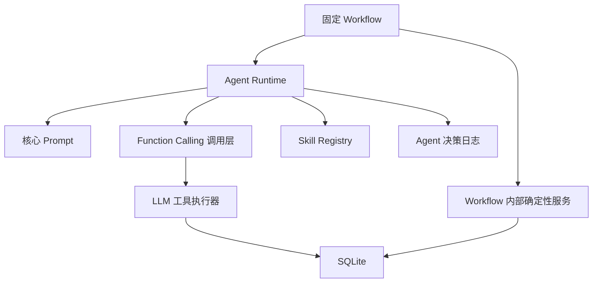

# Learning Agent Runtime

## 目标

Learning Agent Runtime 实现一个单一用途自定义 Agent：

**CET-6 词汇与阅读自适应学习 Agent。**

它必须真实读取本地数据、调用允许的 Function Calling 工具、接收工具结果并继续决策。它不是一次性生成练习的聊天机器人。

## 运行时组成

组成部分：

- 固定 Workflow：控制流程阶段；
- 核心 Prompt：定义 Agent 身份、边界和输出格式；
- Skill Registry：提供 4 类教学 Skill；
- Function Calling 调用层：把模型允许调用的工具请求转发给本地函数；
- LLM 工具执行器：执行画像读取、候选词读取和画像建议提交；
- Workflow 内部确定性服务：执行判分、证据记录、隔离题读取和生成任务校验；
- 决策日志：保存 Agent 的计划、分析和画像建议。

## Agent 决策循环

### 1. 读取上下文

Agent 启动某个阶段时先读取：

- 用户目标；
- 最新派生画像；
- 最近原始证据摘要；
- 候选词；
- 副线待验证信号；
- 可用 Skill 版本。

可能调用：

- `get_user_profile`；
- `get_candidate_vocabulary`。

### 2. 选择目标能力和 Skill

Agent 根据画像和证据选择目标能力：

- 词汇语境识别；
- 长难句与逻辑关系；
- 同义替换与定位；
- 干扰项判断。

然后从 Skill Registry 中选择对应 Skill 版本。

此步骤是 Agent 决策，不是 Function Calling 工具。

### 3. 决定训练参数

Agent 决定：

- 任务场景；
- 文章长度；
- 目标词数量；
- 句法复杂度；
- 选项迷惑度；
- 提示等级；
- 是否需要补救讲解；
- 是否进入第二次短训练。

这些参数必须能回指用户画像、候选词或最近证据。

### 4. 生成训练内容

LLM 根据 Skill 定义生成材料、题目、提示或讲解。

若是客观题，生成内容必须包含：

- 标准答案；
- 可回指材料的答案依据；
- 干扰项错误依据；
- 可能暴露的错误类型；
- Skill 声明的质量校验要求。

后端必须调用 `validate_generated_task` 产生质量校验结果，不能使用模型自称的“已检查通过”。

最小校验包括：

- 必需字段是否存在；
- Skill 版本、目标能力和任务类型是否合法；
- 目标词是否实际出现在材料中；
- 客观题选项和标准答案格式是否合法；
- 答案依据引用的材料内容是否存在；
- 干扰项是否具有对应错误类型；
- 难度和提示参数是否越界。

校验失败时，允许 LLM 按错误原因重试一次。第二次仍失败时，Workflow 使用预先审核的演示种子任务兜底。

### 5. 提交答案并判分

用户作答后，固定 Workflow 调用内部确定性服务：

- `grade_objective_answers`；
- `record_learning_evidence`。

判分结果来自确定性程序。

### 6. 分析错因

Agent 读取判分结果和原始证据，分析错误属于：

- 词汇语境识别；
- 长难句与逻辑关系；
- 同义替换与定位；
- 干扰项判断；
- 提示依赖；
- 其他待人工确认类型。

错因分析必须引用证据，不能覆盖程序判分。

### 7. 决定补救策略或第二次计划

第一次完整主线后，Agent 可以决定：

- 补充解释；
- 降低难度；
- 保持难度；
- 提高难度；
- 追加短练习；
- 第二次计划优先训练哪类能力。

机场副线后，第二次计划还必须读取副线信号，说明哪些词汇或表达进入候选池或待验证标记。

### 8. 提出画像更新建议

Agent 调用：

- `submit_profile_update_suggestion`。

建议必须包含：

- 能力维度；
- 变化方向；
- 理由；
- 证据引用。

程序校验后决定是否应用。Agent 不能直接写画像。

## LLM Function Calling 工具契约

LLM Function Calling 工具契约由 FastAPI 后端的类型模型定义。当前文档只定义语义，不写具体代码。

本 MVP 中，学习 Agent 可以自主调用的 Function Calling 工具仅包括：

- `get_user_profile`；
- `get_candidate_vocabulary`；
- `submit_profile_update_suggestion`。

客观判分、证据记录、隔离题读取和生成任务校验属于 Workflow 内部确定性服务，不由 LLM 决定是否调用。

### 通用返回格式

所有 LLM 工具建议统一返回：

- `ok`：布尔值；
- `data`：成功时的结构化数据；
- `error`：失败时的结构化错误；
- `trace_id`：工具调用追踪 ID。

错误结构：

- `code`：机器可读错误码；
- `message`：面向 Agent 的简短说明；
- `details`：可选细节。

### `get_user_profile`

用途：读取用户目标、最新画像和最近证据摘要。

输入：

- `user_id`；
- `include_recent_evidence`：是否包含最近证据；
- `ability_filter`：可选能力维度。

输出：

- 用户目标；
- 最新画像快照；
- 与能力维度关联的提示依赖、错误类型和置信度；
- 最近证据摘要；
- 最新副线待验证摘要。

失败处理：

- 用户不存在：返回 `USER_NOT_FOUND`；
- 无画像：返回空画像和 `needs_initial_profile` 标记；
- 数据损坏：返回 `PROFILE_LOAD_FAILED`。

### `get_candidate_vocabulary`

用途：由程序根据词库、画像、历史错误和副线信号筛选候选词。

输入：

- `user_id`；
- `workflow_stage`；
- `target_ability`；
- `include_sidequest_signals`。

输出：

- 候选词列表；
- 每个候选词的来源；
- 是否来自副线待验证信号；
- 推荐优先级；
- 筛选原因。

失败处理：

- 阶段非法：返回 `INVALID_WORKFLOW_STAGE`；
- 无候选词：返回成功但列表为空，并给出原因；
- 用户不存在：返回 `USER_NOT_FOUND`。

### `submit_profile_update_suggestion`

用途：提交 Agent 的画像更新建议，由程序校验。

输入：

- `user_id`；
- `ability`；
- `direction`；
- `reason`；
- `evidence_refs`；
- `confidence_note`。

输出：

- 建议 ID；
- 校验状态；
- 是否应用；
- 拒绝原因；
- 应用后的画像摘要。

失败处理：

- 证据引用无效：返回 `INVALID_EVIDENCE_REF`；
- 能力维度无效：返回 `INVALID_ABILITY`；
- 副线信号直接修改画像：返回 `SIDEQUEST_SIGNAL_NOT_FORMAL_EVIDENCE`；
- 更新幅度不合规：返回 `PROFILE_UPDATE_REJECTED`。

## Workflow 内部确定性服务

内部确定性服务可以保留统一输入输出模型和调用日志，但不暴露给 LLM 自主调用。

### `validate_generated_task`

用途：校验 LLM 生成的训练任务是否符合 Skill、题目和难度约束。

输入：

- `task_payload`；
- `skill_version`；
- `target_ability`；
- `task_type`；
- `difficulty_params`；
- `candidate_vocabulary`。

输出：

- 校验是否通过；
- 错误列表；
- 可用于 LLM 一次重试的错误原因；
- 是否需要使用演示种子任务兜底。

失败处理：

- 必需字段缺失：返回 `MISSING_REQUIRED_FIELD`；
- Skill 或能力非法：返回 `INVALID_SKILL_OR_ABILITY`；
- 目标词未出现在材料中：返回 `TARGET_WORD_NOT_FOUND`；
- 答案依据不存在：返回 `RATIONALE_REF_NOT_FOUND`；
- 难度参数越界：返回 `DIFFICULTY_OUT_OF_RANGE`。

### `grade_objective_answers`

用途：确定性判分。

输入：

- `user_id`；
- `task_id` 或 `isolated_attempt_id`；
- `item_answers`；
- `item_versions`。

输出：

- 每题正误；
- 总分；
- 标准答案；
- 答案依据；
- 初步错误类型候选；
- 是否版本匹配。

失败处理：

- 题目版本不匹配：返回 `ITEM_VERSION_MISMATCH`；
- 题目不存在：返回 `ITEM_NOT_FOUND`；
- 答案格式无效：返回 `INVALID_ANSWER_FORMAT`；
- 尝试判分未授权隔离题：返回 `FORBIDDEN_ISOLATED_ITEM_ACCESS`。

### `record_learning_evidence`

用途：保存主线训练、短诊断和短训练任务产生的原始证据。

输入：

- `user_id`；
- `session_id`；
- `task_id`；
- `evidence_type`；
- `payload`。

输出：

- `evidence_id`；
- 保存状态；
- 可被画像建议引用的证据摘要。

失败处理：

- 缺少任务版本：返回 `MISSING_TASK_VERSION`；
- 会话不存在：返回 `SESSION_NOT_FOUND`；
- 副线信号误写正式证据表：返回 `INVALID_EVIDENCE_SOURCE`。

### `get_isolated_test_items`

用途：在隔离检测阶段读取未见题。

`get_isolated_test_items` 是 Workflow 内部确定性服务，不是学习 Agent 可自主调用的 Function Calling 工具。

输入：

- `user_id`；
- `session_id`；
- `target_ability`；
- `item_count`。

输出：

- 隔离题列表；
- 题目版本；
- 目标能力；
- 提交判分所需 ID。

失败处理：

- 当前不是隔离检测阶段：返回 `FORBIDDEN_WORKFLOW_STAGE`；
- 题目不足：返回 `INSUFFICIENT_ISOLATED_ITEMS`；
- 用户或会话不存在：返回 `SESSION_NOT_FOUND`；
- 重复抽题风险：返回 `ITEM_REUSE_BLOCKED`。

隔离检测期间，题目正文、标准答案和解释不得进入学习 Agent 上下文。后端将题目直接发送给 Vue 前端展示。用户提交后由确定性程序判分，Agent 只能在提交和判分后读取结果摘要，用于解释或画像更新建议。

## Skill 与工具的区别

| 项目 | 教学 Skill | LLM Function Calling 工具 | Workflow 内部确定性服务 |
|---|---|---|---|
| 本质 | 教学能力与生成约束 | Agent 可请求的数据或建议接口 | 固定流程中的确定性能力 |
| 是否由 Agent 自主调用 | 是，作为调度对象 | 是 | 否 |
| 是否访问数据库 | 否 | 是 | 是 |
| 是否判分 | 否 | 否 | `grade_objective_answers` 判分 |
| 是否写画像 | 否 | `submit_profile_update_suggestion` 提交建议并校验 | 可在校验通过后写入快照 |
| 是否独立 Agent | 否 | 否 | 否 |
| 示例 | 同义替换与定位 Skill | `get_candidate_vocabulary` | `validate_generated_task` |

Skill 告诉 Agent “如何教和如何生成任务”。LLM Function Calling 工具让 Agent 读取允许暴露的数据或提交建议。Workflow 内部确定性服务负责判分、记录、校验和隔离题访问控制。

## Prompt 结构

实现阶段建议把核心 Prompt 分为：

- 系统 Prompt：定义 Agent 身份、边界、禁止行为；
- Workflow Prompt：定义当前阶段目标；
- Skill Prompt 片段：来自 Skill Registry；
- Tool/Service Result Prompt：把允许暴露给 Agent 的工具或服务结果摘要转为下一步决策上下文；
- Output Format Prompt：要求输出计划、解释、画像建议等结构。

人工重点审核：

- 系统 Prompt；
- LLM 工具调用约束；
- Workflow 内部服务结果暴露边界；
- 画像更新建议格式；
- 隔离检测禁止访问规则；
- 第二次计划变化解释规则。

AI 可以生成：

- Prompt 文件初稿；
- LLM 工具参数模型；
- Workflow 内部服务模型；
- 工具和服务执行器样板；
- Agent 编排循环；
- 前后端接口代码。

## Workflow 阶段与调用边界

| 阶段 | Agent 决策 | LLM 可调用工具 | Workflow 内部确定性服务 |
|---|---|---|
| 初始画像 | 根据诊断形成画像解释 | `submit_profile_update_suggestion` | `record_learning_evidence` |
| 第一次主线计划 | 选能力、Skill、难度、提示 | `get_user_profile`、`get_candidate_vocabulary` | `validate_generated_task` |
| 第一次主线判分 | 分析错因、提出更新 | `submit_profile_update_suggestion` | `grade_objective_answers`、`record_learning_evidence` |
| 机场副线后 | 读取待验证信号 | `get_user_profile`、`get_candidate_vocabulary` | 写入副线信号的 Workflow 服务 |
| 第二次计划 | 根据画像和副线信号调整计划 | `get_user_profile`、`get_candidate_vocabulary` | `validate_generated_task` |
| 短训练 | 执行变化后的任务 | 可读取画像或候选词 | `grade_objective_answers`、`record_learning_evidence` |
| 隔离检测 | 提交后解释结果或提出建议 | 提交后可用 `get_user_profile`、`submit_profile_update_suggestion` | `get_isolated_test_items`、`grade_objective_answers`、`record_learning_evidence` |

## 失败恢复

### LLM 工具调用失败

Agent 必须：

- 读取错误码；
- 不伪造工具结果；
- 给出可恢复提示；
- 在必要时停止当前阶段。

例如，如果 Agent 试图请求未暴露的隔离题读取服务，后端必须拒绝该请求，并要求模型按当前阶段继续，不得改为自行生成隔离题。

### LLM 输出不合规

后端应校验 LLM 输出：

- 是否包含必需字段；
- 是否引用不存在的证据；
- 是否试图直接修改画像；
- 是否把副线信号当正式证据；
- 是否请求非法工具。

校验失败时，可以要求模型重试一次。仍失败则返回前端可读错误，并记录日志。

### 判分或记录失败

判分或证据保存失败时：

- 不继续画像更新；
- 不进入下一阶段；
- 前端展示错误；
- `tool_call_logs` 保存失败记录。

## 最小演示运行路径

1. 创建演示用户并填写目标；
2. 提交短诊断；
3. Agent 读取画像和候选词，生成第一次主线计划；
4. 用户完成一个训练题；
5. 程序判分并记录证据；
6. Agent 分析错因并提交画像更新建议；
7. 用户完成机场购票任务；
8. 副线信号进入候选池或待验证标记；
9. Agent 生成第二次自适应计划；
10. 用户完成一个短训练任务；
11. 进入隔离检测；
12. 程序判分并展示结果。

该路径足以截图证明课程要求。
