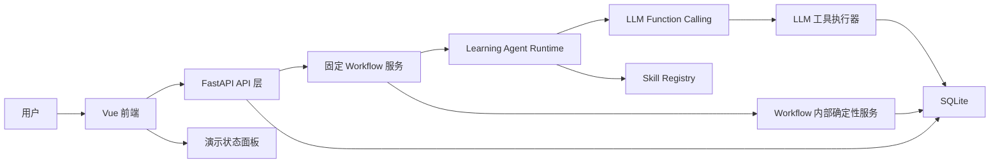

# LingoForge 课程作业版 MVP 架构

## 架构结论

课程作业版 MVP 采用：

**Vue + FastAPI + SQLite + 原生模型 Function Calling 的模块化单体架构。**

该方案已确认作为当前架构方向。目标是优先满足课程作业的可运行、可演示和可解释要求，而不是追求长期产品级复杂度。

## 课程要求映射

| 课程要求 | 架构响应 |
|---|---|
| 单一用途自定义 Agent | 实现一个 CET-6 词汇与阅读学习 Agent |
| 至少两个可调用工具 | LLM 可调用工具保留 `get_user_profile`、`get_candidate_vocabulary`、`submit_profile_update_suggestion` |
| 标准 Function Calling 或 MCP | 当前采用原生模型 Function Calling，不强制使用 MCP |
| AI 生成主要代码和样板 | 后续由 AI 生成 FastAPI、Vue、SQLite、工具参数模型和接口逻辑 |
| 人工负责核心设计 | 人工确认架构选择、核心 Prompt、工具契约和 Agent 编排循环 |
| 最终提交物 | GitHub 仓库链接、可运行代码、核心 Prompt、Skill、架构与数据模型文档、`.env.example` 和经过复跑的 README 命令 |

## 总体结构

系统是一个模块化单体：

- 前端和后端分离运行；
- 后端内部保持单体模块边界；
- 不引入微服务、消息队列、多 Agent、独立向量库或复杂基础设施；
- SQLite 作为本地可追溯数据存储；
- 原生 Function Calling 连接 Agent 与允许 LLM 自主调用的本地工具；
- 固定 Workflow 内部确定性服务由 FastAPI 调用，不由 LLM 决定是否调用。

## 组件职责

### Vue 前端

Vue 负责用户交互与本地运行状态呈现。

MVP 页面建议：

- 目标与诊断页：收集用户目标，完成短诊断；
- 主线训练页：展示 Agent 计划、材料、题目、作答和讲解；
- Agent 观察页：展示 Agent 决策、Skill 选择、工具调用记录和画像变化；
- 机场副线页：展示航班信息、NPC 要求、购票选择和副线信号；
- 隔离检测页：展示未见题、提交答案、统一展示结果；
- 总结页：展示完整流程和证据链。

前端不负责：

- 判分；
- 画像更新；
- 隔离题访问控制；
- Agent 决策；
- Function Calling 工具执行。

前端状态管理保持简单。MVP 默认使用组件状态和轻量 API client，不引入 Pinia，除非后续页面状态复杂到明显影响开发效率。

### FastAPI 后端

FastAPI 是系统边界与编排中心。

职责：

- 提供 REST API；
- 执行固定 Workflow；
- 管理 Agent 运行时；
- 定义 Function Calling 工具参数模型；
- 校验前端输入；
- 执行确定性判分和数据校验；
- 执行生成任务质量校验；
- 访问 SQLite；
- 控制隔离题访问阶段；
- 记录工具调用、Agent 决策和原始证据。

FastAPI 适合作业版 MVP 的原因：

- 类型模型适合工具契约；
- 参数校验清楚；
- 自动 API 文档便于调试和开发核验；
- Python 生态适合快速实现 Agent 编排。

### SQLite

SQLite 保存本地数据。

职责：

- 用户目标；
- 派生画像；
- 原始学习证据；
- 训练任务与题目版本；
- Function Calling 工具调用日志；
- 副线待验证信号；
- 隔离题集和检测结果。

SQLite 不是为了复杂生产并发，而是为了课程作业中的可追溯性、本地运行便利性和数据边界清晰。

### Learning Agent Runtime

Learning Agent Runtime 承载单个学习 Agent。

Agent 负责：

- 读取目标、画像、候选词和最近证据；
- 选择目标能力；
- 选择 4 类教学 Skill 中的一个或多个；
- 决定难度、提示等级、题型和训练参数；
- 调用 Function Calling 工具；
- 读取工具返回结果；
- 分析错因；
- 决定补救策略或第二次计划；
- 提出结构化画像更新建议。

Agent 不负责：

- 客观判分；
- 直接写入正式画像；
- 直接访问隔离题集；
- 根据副线表现认定能力提升；
- 自行宣称长期提分。

### Skill Registry

Skill Registry 保存 4 类 CET-6 阅读 Skill 的结构化定义：

1. 词汇语境识别 Skill；
2. 长难句与逻辑关系 Skill；
3. 同义替换与定位 Skill；
4. 干扰项判断 Skill。

Skill 是教学能力，不是 Function Calling 工具，也不是独立 Agent。

每个 Skill 至少包含：

- `skill_id`；
- `version`；
- 目标能力；
- 适用条件；
- 可调难度参数；
- 训练或题目生成规则；
- 质量校验要求；
- 可观察证据；
- 常见错误类型。

Agent 调度 Skill，LLM 根据 Skill 定义生成材料、题目、提示或讲解。确定性程序根据 Skill 声明的质量校验要求调用 `validate_generated_task` 产生校验结果。模型自称“校验通过”不能作为真实校验结果。

## 核心边界

### Agent 决策

Agent 可以决定：

- 当前训练能力；
- 采用哪个 Skill；
- 任务类型；
- 目标词比例；
- 难度参数；
- 提示策略；
- 补救策略；
- 第二次自适应计划；
- 画像更新建议。

### 固定 Workflow

Workflow 固定为：

1. 首次目标收集；
2. 短诊断；
3. 初始画像；
4. 第一次完整主线学习；
5. 画像更新；
6. 机场副线任务；
7. 副线信号进入候选池或待验证标记；
8. 第二次自适应主线计划；
9. 至少一个体现变化的短训练任务；
10. 短隔离检测。

Agent 不得跳过判分、记录、校验、隔离检测和副线边界。

### LLM Function Calling 工具

LLM Function Calling 工具是 Agent 可以自主请求调用的本地接口。MVP 保留：

- `get_user_profile`；
- `get_candidate_vocabulary`；
- `submit_profile_update_suggestion`。

工具必须有明确输入、输出和失败处理。工具返回结构化结果，Agent 必须读取工具结果再继续决策。

### Workflow 内部确定性服务

以下服务由 FastAPI 固定 Workflow 调用，不暴露为 LLM 可自主调用的 Function Calling 工具：

- `validate_generated_task`：校验 LLM 生成的训练任务；
- `grade_objective_answers`：客观题判分；
- `record_learning_evidence`：保存原始学习证据；
- `get_isolated_test_items`：仅在隔离检测阶段读取隔离题。

这些服务可以保留统一输入输出模型和调用日志，但调用时机由 Workflow 决定，而不是由 LLM 决定。

### 确定性程序

确定性程序负责：

- 客观题判分；
- 原始证据保存；
- 生成任务质量校验；
- 数据合法性校验；
- 画像更新建议校验；
- 隔离题阶段控制；
- 防止训练流程访问隔离题；
- 副线信号和正式画像隔离。

## 前后端接口方向

MVP 建议使用少量面向流程的 REST API，而不是过早设计复杂资源 API。

建议 API 类别：

- `POST /api/session/start`：创建或重置演示用户流程；
- `POST /api/onboarding`：保存首次目标；
- `POST /api/diagnostic/submit`：提交短诊断；
- `POST /api/main/plan`：触发 Agent 生成主线计划；
- `POST /api/main/answer`：提交训练答案并触发判分、记录和分析；
- `POST /api/sidequest/complete`：提交机场副线结果；
- `POST /api/main/second-plan`：触发第二次自适应计划；
- `POST /api/isolated-test/start`：进入隔离检测阶段；
- `POST /api/isolated-test/submit`：提交隔离检测答案；
- `GET /api/demo/state`：读取 Demo 流程状态总览。

这些 API 面向演示流程，不代表未来产品最终接口。

## 由大模型完成与由程序完成

大模型完成：

- 理解用户目标；
- 根据画像选择训练能力；
- 调度 Skill；
- 生成低压力材料、题目草案、提示和讲解；
- 分析错因；
- 生成第二次计划解释；
- 提出画像更新建议；
- 生成面向用户和开发核验的可读说明。

确定性程序完成：

- 校验输入；
- 访问数据库；
- 筛选候选词；
- 判分；
- 保存原始证据；
- 保存工具调用日志；
- 校验画像更新建议；
- 控制隔离题访问；
- 记录副线信号；
- 提供 API 返回。

## 隔离题访问策略

隔离题存储在独立数据表中，并由后端阶段状态控制。

规则：

- 训练生成、补救练习、第二次计划阶段不能访问隔离题内容；
- `get_isolated_test_items` 不是 LLM 可调用工具；
- 只有 Workflow 进入 `ISOLATED_TEST` 阶段后，FastAPI 内部服务才可读取隔离题；
- 后端将题目直接发送给 Vue 前端展示；
- 隔离检测期间，题目正文、标准答案和解释不得进入学习 Agent 上下文；
- 用户提交后由确定性程序判分；
- Agent 只能在提交和判分后读取结果摘要，用于解释或画像更新建议；
- 服务调用日志记录每次隔离题访问；
- 隔离检测提交后统一判分和解释；
- 隔离检测结果可以作为较高置信度证据，但仍须通过画像更新校验。

## 生成任务质量校验

LLM 生成训练任务后，FastAPI 必须调用内部确定性服务 `validate_generated_task`。

最小校验包括：

- 必需字段是否存在；
- Skill 版本、目标能力和任务类型是否合法；
- 目标词是否实际出现在材料中；
- 客观题选项和标准答案格式是否合法；
- 答案依据引用的材料内容是否存在；
- 干扰项是否具有对应错误类型；
- 难度和提示参数是否越界。

校验失败时：

1. 允许 LLM 按错误原因重试一次；
2. 第二次仍失败时，使用预先审核的演示种子任务兜底；
3. 不得把模型自称“校验通过”作为真实校验结果。

## 开发核验素材

浏览器截图或 GIF 只作为开发核验和 README 可选素材，不作为固定数量交付要求。建议优先覆盖以下状态：

1. 初始画像：目标收集、短诊断结果、4 类能力画像。
2. 第一次主线：Agent 选择 Skill、候选词、难度参数和工具调用记录。
3. 机场副线：航班选择任务、副线信号进入候选池或待验证标记。
4. 第二次计划与隔离检测：展示计划变化、短训练任务、隔离检测结果。

核验重点不是界面华丽，而是证明 Agent 真实调度、工具真实调用、数据边界清晰。

## 当前不做

本架构阶段不做：

- 微服务；
- 多 Agent；
- MCP 强制接入；
- 消息队列；
- 复杂前端状态管理；
- 用户账号体系；
- 支付、社交、排行榜；
- 生产级权限系统；
- 长期学习数据分析平台；
- 全 CET-6 题型覆盖；
- 真题原文复制。

## 主要风险

| 风险 | 影响 | 缓解 |
|---|---|---|
| Agent 只是生成内容，没有真实工具循环 | 无法满足课程要求 | LLM 工具调用日志和 Workflow 服务日志必须在前端展示 |
| Skill 变成泛化提示词 | 失去真题炼化核心 | Skill Registry 使用结构化元数据 |
| 第二次计划只换主题 | 自适应验收失败 | 验收要求 Skill、能力、难度、题型或提示策略至少一项变化 |
| 副线污染画像 | 破坏数据可信度 | 副线信号独立表保存，只进候选池或待验证 |
| 隔离题泄漏 | 失去验收意义 | 隔离题仅由 Workflow 内部服务读取，不进入 Agent 上下文 |
| Vue 页面拖慢进度 | 影响交付 | 只做演示所需页面，不引入复杂状态库 |
