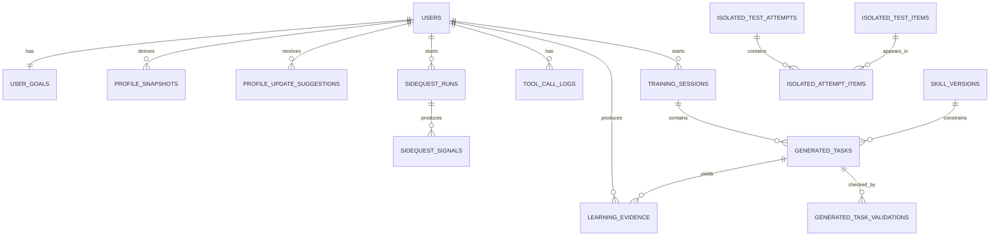

# LingoForge MVP 数据模型

## 设计目标

数据模型服务课程作业版 MVP 的三个目标：

1. 支持真实 Agent 决策循环；
2. 明确区分原始证据、派生画像、副线信号和隔离题；
3. 让课堂演示能展示清楚的证据链。

当前文档定义的是 SQLite 逻辑数据模型，不是最终迁移脚本。具体字段类型、索引和迁移文件在实现阶段由 AI 生成，并接受人工审核。

## 数据边界原则

### 原始证据不可被画像替代

用户答案、用时、提示使用、点击行为、题目版本、判分结果等属于原始证据。原始证据只追加，不被派生画像覆盖。

### 派生画像可更新但必须可追溯

画像是根据证据形成的判断。每次画像更新必须能回指：

- 相关用户；
- 能力维度；
- 证据 ID；
- Agent 建议；
- 程序校验结果；
- 更新时间。

### 副线信号不等于正式能力证据

副线任务只产生曝光与待验证信号。副线信号可提高候选词优先级或触发待验证标记，但不能直接修改正式能力画像。

### 隔离题集对训练流程不可见

隔离题单独存储。普通训练生成、补救练习和 Agent 第二次计划阶段不能读取隔离题内容。

## 数据域概览

## 最小表设计

### `users`

保存演示用户。

最小字段：

- `id`：用户 ID；
- `display_name`：展示名称；
- `created_at`；
- `updated_at`。

MVP 不做完整账号体系，可使用单个默认演示用户。

### `user_goals`

保存首次目标收集结果。

最小字段：

- `id`；
- `user_id`；
- `exam_type`：MVP 固定为 CET-6；
- `days_until_exam`；
- `target_score`；
- `daily_minutes`；
- `self_reported_weaknesses`：JSON；
- `interest_topics`：JSON；
- `created_at`。

### `profile_snapshots`

保存派生画像快照。

最小字段：

- `id`；
- `user_id`；
- `source`：`DIAGNOSTIC`、`MAIN_TRAINING`、`ISOLATED_TEST` 等；
- `profile_json`：4 类能力维度和横向记录；
- `evidence_refs`：JSON，引用原始证据；
- `created_at`。

`profile_json` 的语义结构：

- `vocabulary_context`；
- `sentence_logic`；
- `paraphrase_location`；
- `distractor_judgement`。

每个能力维度尽量包含：

- `status`：能力判断；
- `prompt_dependency`；
- `common_error_types`；
- `confidence`；
- `recent_evidence_ids`。

MVP 不锁定具体数值公式。`confidence` 可以先使用简单等级，例如 `LOW`、`MEDIUM`、`HIGH`。

### `profile_update_suggestions`

保存 Agent 的结构化画像更新建议和程序校验结果。

最小字段：

- `id`；
- `user_id`；
- `ability`；
- `direction`：`IMPROVE`、`DECLINE`、`UNCERTAIN`、`NO_CHANGE`；
- `reason`；
- `evidence_refs`：JSON；
- `agent_payload`：完整建议 JSON；
- `validation_status`：`ACCEPTED`、`REJECTED`、`NEEDS_REVIEW`；
- `rejection_reason`；
- `created_at`。

该表记录 Agent 建议，不代表建议一定被应用。被应用后的结果体现在新的 `profile_snapshots` 中。

### `vocabulary_items`

保存 CET-6 候选词和副线环境词。

最小字段：

- `id`；
- `text`；
- `meaning_zh`；
- `tags`：JSON，例如 CET-6、airport、collocation；
- `source_type`：`CET6_VOCAB`、`SIDEQUEST_ENV`、`SEED_DEMO`；
- `created_at`。

MVP 使用少量种子数据即可，不追求完整词库。

### `candidate_vocabulary_events`

保存候选词筛选结果。

最小字段：

- `id`；
- `user_id`；
- `workflow_stage`；
- `ability`；
- `candidate_items`：JSON；
- `included_sidequest_signal_ids`：JSON；
- `selection_reason`；
- `created_at`。

该表用于证明 Agent 的目标词来自程序候选池，不是自由选择。

### `skill_versions`

保存 4 类教学 Skill 的版本元数据。

最小字段：

- `id`；
- `skill_id`；
- `version`；
- `target_ability`；
- `applicable_conditions`：JSON；
- `difficulty_params`：JSON；
- `generation_rules`：JSON；
- `quality_requirements`：JSON；
- `observable_evidence`：JSON；
- `common_error_types`：JSON；
- `created_at`。

Skill 元数据用于 Agent 调度与生成约束，不是 Function Calling 工具。

### `training_sessions`

保存一次训练或演示流程阶段。

最小字段：

- `id`；
- `user_id`；
- `stage`：`DIAGNOSTIC`、`FIRST_MAIN`、`SIDEQUEST`、`SECOND_PLAN`、`SHORT_TRAINING`、`ISOLATED_TEST`；
- `status`：`PENDING`、`IN_PROGRESS`、`COMPLETED`；
- `started_at`；
- `completed_at`。

Workflow 阶段控制依赖该表或等价状态。隔离题读取服务必须检查当前阶段。

### `generated_tasks`

保存由 Agent 和 Skill 生成的材料、题目或讲解任务。

最小字段：

- `id`；
- `session_id`；
- `user_id`；
- `task_type`：`LOW_PRESSURE_LEARNING`、`TRANSFER_PRACTICE`、`REMEDIATION`、`SHORT_TRAINING`；
- `skill_version_id`；
- `target_ability`；
- `difficulty_params`：JSON；
- `content_json`：材料、题干、选项、提示等；
- `quality_requirements`：JSON；
- `quality_check_result`：JSON；
- `created_at`。

如果任务包含客观题，标准答案与答案依据应保存在 `content_json` 或关联的题目结构中，但前端展示时必须避免提前泄漏答案。

### `generated_task_validations`

保存 `validate_generated_task` 对 LLM 生成任务的确定性校验结果。

最小字段：

- `id`；
- `task_id`；
- `validation_status`：`PASSED`、`FAILED`、`FALLBACK_USED`；
- `error_codes`：JSON；
- `error_details`：JSON；
- `attempt_number`：1 或 2；
- `used_seed_fallback`；
- `created_at`。

最小校验包括：

- 必需字段是否存在；
- Skill 版本、目标能力和任务类型是否合法；
- 目标词是否实际出现在材料中；
- 客观题选项和标准答案格式是否合法；
- 答案依据引用的材料内容是否存在；
- 干扰项是否具有对应错误类型；
- 难度和提示参数是否越界。

模型自称“校验通过”不得写入该表作为真实通过结果。

### `learning_evidence`

保存主线训练和诊断产生的原始证据。

最小字段：

- `id`；
- `user_id`；
- `session_id`；
- `task_id`；
- `evidence_type`：`DIAGNOSTIC_ANSWER`、`TRAINING_ANSWER`、`PROMPT_USAGE`、`CLICK_EVENT`、`GRADING_RESULT`；
- `payload_json`；
- `created_at`。

该表不保存副线信号。副线信号使用独立表。

### `sidequest_signals`

保存机场副线产生的曝光与待验证信号。

最小字段：

- `id`；
- `user_id`；
- `sidequest_run_id`；
- `scene`：MVP 为 `AIRPORT_TICKET`；
- `vocabulary_item_id`；
- `expression_text`；
- `context_json`：航班牌、NPC 要求、购票表单等；
- `signal_type`：`EXPOSURE`、`CLICKED_HINT`、`MISRECOGNIZED`、`TASK_SUCCESS`、`TASK_FAILED`；
- `is_pending_verification`；
- `created_at`。

副线信号不能直接更新 `profile_snapshots`。

### `sidequest_runs`

保存一次机场副线任务运行。

最小字段：

- `id`；
- `user_id`；
- `task_name`：`AIRPORT_TICKET_PURCHASE`；
- `objective_json`；
- `result_json`；
- `completed_at`。

副线任务结果只证明该副线任务是否完成，不证明 CET-6 能力提升。

### `isolated_test_items`

保存隔离检测题。

最小字段：

- `id`；
- `target_ability`；
- `item_version`；
- `item_payload`：题干、材料、选项；
- `answer_key`；
- `answer_rationale`；
- `distractor_rationale`；
- `is_active`；
- `created_at`。

隔离题内容不得通过普通训练工具、LLM Function Calling 工具或普通任务生成流程读取。

### `isolated_test_attempts`

保存隔离检测提交与结果。

最小字段：

- `id`；
- `user_id`；
- `session_id`；
- `item_ids`：JSON；
- `user_answers`：JSON；
- `score_json`；
- `time_spent_seconds`；
- `created_at`。

隔离检测结果可作为更高置信度证据，但仍需通过画像更新校验。

### `isolated_attempt_items`

概念连接实体，用于表达一次隔离检测尝试可以包含多道隔离题。

最小字段：

- `id`；
- `attempt_id`；
- `isolated_test_item_id`；
- `item_order`；
- `item_version`。

当前不要求锁定最终物理字段、索引或迁移脚本；实现阶段可根据 SQLite 简化为连接表或 JSON 字段加约束校验。

### `tool_call_logs`

保存 LLM Function Calling 工具调用记录，也可以保存 Workflow 内部确定性服务调用记录。

最小字段：

- `id`；
- `user_id`；
- `session_id`；
- `call_name`；
- `call_type`：`LLM_TOOL` 或 `WORKFLOW_SERVICE`；
- `input_json`；
- `output_json`；
- `status`：`SUCCESS`、`FAILED`；
- `error_code`；
- `created_at`。

该表是课程演示的重要依据，用于证明 Agent 确实调用了允许的本地工具，也用于展示 Workflow 内部服务如何完成判分、记录、校验和隔离题读取。

### `agent_decision_logs`

保存 Agent 的关键决策。

最小字段：

- `id`；
- `user_id`；
- `session_id`；
- `decision_type`：`PLAN`、`SKILL_SELECTION`、`ERROR_ANALYSIS`、`REMEDIATION`、`SECOND_PLAN`；
- `input_summary_json`；
- `decision_json`；
- `evidence_refs`：JSON；
- `created_at`。

该表面向演示和调试，不作为正式画像。

## 数据流

### 第一次主线

1. `user_goals` 保存目标；
2. `learning_evidence` 保存诊断答案；
3. `profile_snapshots` 生成初始画像；
4. `candidate_vocabulary_events` 保存候选词；
5. `generated_tasks` 保存训练任务；
6. `learning_evidence` 保存答案、用时、提示和判分结果；
7. `profile_update_suggestions` 保存 Agent 建议；
8. `profile_snapshots` 保存程序校验后的新画像。

### 机场副线

1. `sidequest_runs` 保存任务结果；
2. `sidequest_signals` 保存词汇曝光、点击和待验证标记；
3. `candidate_vocabulary_events` 在第二次计划前引用相关副线信号。

### 第二次计划与短训练

1. Agent 读取 `profile_snapshots` 最新画像；
2. 工具读取 `candidate_vocabulary_events` 和 `sidequest_signals`；
3. `agent_decision_logs` 保存第二次计划；
4. `generated_tasks` 保存短训练任务；
5. `learning_evidence` 保存短训练证据。

### 隔离检测

1. Workflow 进入 `ISOLATED_TEST`；
2. FastAPI Workflow 内部服务 `get_isolated_test_items` 从 `isolated_test_items` 读取题目；
3. 后端将题目直接发送给 Vue 前端，题目正文、标准答案和解释不进入学习 Agent 上下文；
4. `isolated_test_attempts` 和 `isolated_attempt_items` 保存提交关系、答案和结果；
5. 用户提交并完成确定性判分后，Agent 只能读取结果摘要进行解释或画像建议；
6. 如需更新画像，仍经 `profile_update_suggestions` 和 `profile_snapshots`。

## 失败与一致性原则

- 写入原始证据失败时，不得继续画像更新；
- 画像更新建议引用不存在的证据时，必须拒绝；
- 隔离题读取服务在非隔离阶段调用时，必须拒绝；
- 副线信号不得写入 `learning_evidence` 作为正式证据；
- LLM 工具或 Workflow 内部服务调用失败必须写入 `tool_call_logs`，方便演示和排错。

## MVP 简化

为保证课程期限内落地：

- 不设计复杂用户权限；
- 不做多用户并发优化；
- 不做完整词库管理后台；
- 不实现复杂复习算法；
- 不实现完整考试题库；
- 不使用 ORM 复杂关系映射作为课程重点；
- 种子数据可以覆盖演示所需最小流程。
