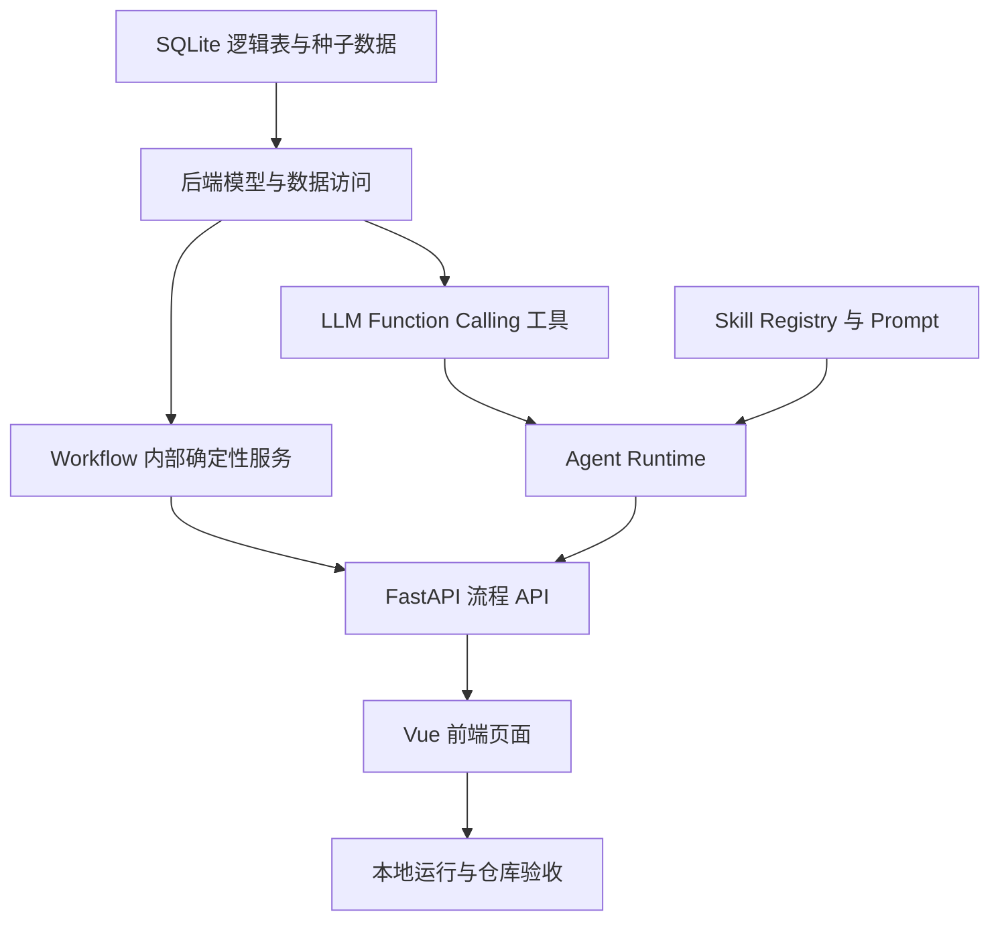

# LingoForge 课程作业版 MVP 实施计划

## 实施原则

当前计划服务课程作业版 MVP。目标是在期限内完成可安装、可启动、可测试、可复跑的 GitHub 仓库，而不是一次性建设长期产品。

最新人工确认后，最终核心交付物是 GitHub 仓库链接。仓库验收重点是：

- 能安装；
- 能启动；
- 能重置 Demo 数据；
- 能运行测试；
- 能走通完整主流程；
- 核心 Prompt 和 Skill 可查看；
- 架构与数据模型可查看；
- `.env.example` 完整；
- README 命令经过实际复跑；
- 不泄露 API 密钥。

允许保留 README 中的可选截图或 GIF、开发核验用浏览器截图、架构图、ER 图和运行说明。不再强制提交固定数量截图或实验报告。

原则：

- Codex 是主开发者，负责完整项目主要实现；
- 先让核心 Agent 循环跑通，再实现完整 Vue 界面；
- 先实现 Workflow 内部确定性服务和允许的 LLM 工具，再接 LLM；
- 先用最小种子数据，再扩展内容；
- 每个阶段都能独立运行或验证；
- 不引入微服务、多 Agent、消息队列或复杂基础设施；
- 不引入 Pinia，除非简单组件状态明显无法支撑核心流程。

## AI 开发分工

默认执行者为 `CODEX`。

`CODEX` 负责：

- 总体架构与架构变更；
- 超详细实施规划与原子任务拆分；
- Agent Runtime；
- Function Calling 工具和编排循环；
- Workflow 状态控制；
- 数据模型、核心接口和复杂查询；
- 隔离题访问保护；
- 画像更新校验；
- 生成任务质量校验与兜底；
- 核心 Prompt 与教学 Skill；
- 所有复杂、高风险代码；
- 完整 Vue 前端的设计与实现；
- GPT Image 2 视觉资产规划、生成、落地、集成和浏览器验证；
- 前后端集成；
- 浏览器运行、测试和最终审查。

`CC_DS` 仅可作为 Codex 规划下的辅助执行者，处理边界明确、低风险、机械性的任务。每个 `CC_DS` 任务必须在 `docs/TASK_BREAKDOWN.md` 中写清文件范围、接口、输入输出、实现步骤、测试命令、验收标准和禁止修改范围。

`CC_DS` 不得自行设计前端、承担完整 Vue 页面、自行调用 Image 2、修改架构、修改公共接口、修改核心数据模型、重写 Agent Runtime、改变 Prompt 或 Skill 语义，或扩大 MVP 范围。

## 技术方向

已确认技术方向：

- 前端：Vue；
- 后端：FastAPI；
- 数据：SQLite；
- Agent：单个学习 Agent；
- 工具连接：原生模型 Function Calling；
- 架构：前后端分离运行的模块化单体。

## LLM Provider 方案

首个真实模型 Provider 确认为：

- Provider：DeepSeek；
- 模型：`deepseek-v4-flash`；
- 默认非思考模式；
- 必须支持 Mock 模式；
- 必须通过 Provider Adapter 隔离模型供应商；
- 真实 DeepSeek 接入前必须使用 `source-driven-development` 核对 DeepSeek 官方 API 文档，不凭记忆实现。

推荐环境变量：

```env
LLM_MODE=mock
LLM_PROVIDER=deepseek
DEEPSEEK_API_KEY=
DEEPSEEK_BASE_URL=https://api.deepseek.com
DEEPSEEK_MODEL=deepseek-v4-flash
DEEPSEEK_THINKING_ENABLED=false
```

约束：

- 默认本地开发使用 `LLM_MODE=mock`；
- `DEEPSEEK_API_KEY` 只存在于本地 `.env`，不得写入仓库；
- Provider Adapter 必须屏蔽具体供应商差异；
- Provider 与工具调用循环测试不得依赖真实 API。

实现阶段开始前，应按需使用 `source-driven-development` 查询 FastAPI、Vue、SQLite 访问库和所选模型 Function Calling 的官方文档，确认最新 API 和推荐写法。真实 DeepSeek 接入前必须核对 DeepSeek 官方 API 文档。

## 依赖关系



## 阶段 0：人工确认与准备

目标：确认架构文档可进入实现。

任务：

- 审核 `docs/ARCHITECTURE.md`；
- 审核 `docs/DATA_MODEL.md`；
- 审核 `docs/AGENT_RUNTIME.md`；
- 审核本实施计划；
- 确认使用的 LLM API 与本地环境变量命名。

验收：

- 人工确认可以进入代码实现；
- 明确是否需要真实模型 API，或先用 mock LLM 跑通工具链。

## 阶段 1：项目骨架与运行命令

目标：建立最小前后端运行环境。

任务 1：创建后端基础

- 建立 FastAPI 应用；
- 提供健康检查接口；
- 配置 SQLite 路径；
- 配置环境变量读取。

验收：

- 后端可在 Windows 本地启动；
- 健康检查接口返回成功；
- 不包含业务逻辑膨胀。

任务 2：创建前端基础

- 建立 Vue 应用；
- 配置开发服务器；
- 建立最小 API client；
- 展示后端健康状态。

验收：

- 前端可在 Windows 本地启动；
- 前端能调用后端健康检查；
- 不引入复杂状态管理。

检查点：

- 前后端均可独立运行；
- README 或开发说明中有启动命令；
- 没有业务代码提前堆叠。

## 阶段 2：SQLite 数据与种子内容

目标：建立支持演示闭环的最小数据基础。

任务 3：实现最小表结构

覆盖：

- 用户与目标；
- 派生画像；
- 原始证据；
- Skill 版本；
- 训练任务；
- 生成任务校验记录；
- LLM 工具和内部服务调用日志；
- 副线信号；
- 隔离题；
- 隔离检测题目连接实体；
- Agent 决策日志。

验收：

- 能初始化本地 SQLite；
- 原始证据、画像、副线信号和隔离题分表保存；
- `SIDEQUEST_RUNS` 与 `SIDEQUEST_SIGNALS` 是一对多关系；
- `ISOLATED_TEST_ATTEMPTS` 与 `ISOLATED_TEST_ITEMS` 通过 `ISOLATED_ATTEMPT_ITEMS` 表达多对多关系；
- 隔离题不被普通训练查询使用。

任务 4：准备演示种子数据

覆盖：

- 一个演示用户；
- 少量 CET-6 候选词；
- 4 类 Skill 元数据；
- 诊断题；
- 训练题或生成任务模板；
- 机场副线词汇；
- 2 到 3 道隔离检测题。

验收：

- 种子数据足以跑完整演示；
- 隔离题与训练题内容分离；
- 不使用真实真题原文复制。

检查点：

- 可以重置 demo 数据；
- 数据边界可通过数据库查看验证。

## 阶段 3：LLM 工具与 Workflow 内部服务

目标：实现 Agent 可调用的 LLM Function Calling 工具，以及固定 Workflow 内部确定性服务。

任务 5：实现 LLM Function Calling 工具参数模型和执行器

LLM 可调用工具：

- `get_user_profile`；
- `submit_profile_update_suggestion`。

验收：

- 每个 LLM 工具有输入模型、输出模型和结构化错误；
- LLM 工具调用写入 `tool_call_logs`，并标记 `call_type = LLM_TOOL`；
- 非法输入被拒绝。

任务 6：实现 Workflow 内部确定性服务

内部服务：

- `validate_generated_task`；
- `grade_objective_answers`；
- `record_learning_evidence`；
- `get_isolated_test_items`。

验收：

- 内部服务有统一输入输出模型和结构化错误；
- 内部服务调用写入 `tool_call_logs`，并标记 `call_type = WORKFLOW_SERVICE`；
- 客观题判分不依赖 LLM；
- 生成任务质量校验不依赖 LLM 自称；
- 画像建议必须引用存在的证据；
- 副线信号不能直接修改正式画像；
- 非隔离阶段调用隔离题读取服务会失败；
- `get_isolated_test_items` 不暴露给 LLM 自主调用。

任务 7：实现生成任务质量校验与兜底

验收：

- `validate_generated_task` 至少校验必需字段、Skill 版本、目标能力、任务类型、目标词覆盖、客观题答案格式、答案依据、干扰项错误类型、难度和提示参数；
- 校验失败时允许 LLM 按错误原因重试一次；
- 第二次仍失败时使用预先审核的演示种子任务兜底；
- 校验结果写入生成任务校验记录；
- 模型自称“校验通过”不会被当作真实校验结果。

检查点：

- 在没有 LLM 的情况下，LLM 工具和内部服务可被单独调用并返回正确结果；
- 工具失败、服务失败和生成任务兜底案例可演示。

## 阶段 4：Skill Registry 与核心 Prompt

目标：建立 Agent 的教学能力约束。

任务 8：实现 Skill Registry

覆盖 4 类 Skill：

- 词汇语境识别；
- 长难句与逻辑关系；
- 同义替换与定位；
- 干扰项判断。

验收：

- 每类 Skill 有版本、目标能力、适用条件、难度参数、生成规则、质量校验要求和常见错误类型；
- Skill 不是独立 Agent；
- Function Calling 工具和 Workflow 内部服务不混入 Skill 定义。

任务 9：编写核心 Prompt

Prompt 至少包括：

- Agent 系统 Prompt；
- LLM 可调用工具规则；
- Workflow 内部服务不可由 Agent 自主调用的规则；
- 画像更新建议格式；
- Skill 调度规则；
- 隔离题禁止访问规则；
- 生成任务校验失败后的重试与兜底规则；
- 第二次计划变化解释规则。

验收：

- Prompt 文件可提交；
- 人工可审查；
- Prompt 明确禁止 Agent 直接判分、直接记录正式证据、直接访问隔离题和直接修改画像。

检查点：

- Prompt 与 Skill 定义能生成结构化计划；
- 不接真实模型时可用 mock 返回调试后端流程。

## 阶段 5：Agent Runtime

目标：跑通单个学习 Agent 决策循环。

任务 10：实现第一次主线 Agent 流程

流程：

- 读取画像；
- 读取候选词；
- 选择 Skill；
- 生成训练参数；
- 生成训练任务；
- 展示 Agent 决策。

验收：

- Agent 至少调用 `get_user_profile`；
- 决策日志保存；
- 前端能看到 Skill、能力和参数。

任务 11：实现作答、判分、记录和画像建议

流程：

- 用户提交训练答案；
- 程序判分；
- 保存原始证据；
- Agent 分析错因；
- Agent 提交画像更新建议；
- 程序校验并生成新画像快照。

验收：

- 工具调用链可见；
- 原始证据和派生画像分离；
- Agent 不能直接修改画像。

检查点：

- 第一次完整主线学习可端到端完成；
- 前端或 API 状态能展示工具调用、错因和画像更新。

## 阶段 6：Vue 前端页面

目标：由 Codex 完整实现 Vue 前端、GPT Image 2 辅助视觉资产、真实浏览器验证和核心流程页面。

实现前必须使用项目专用 Skill：

- `.agents/skills/image2-ui-vue-web/SKILL.md`

前端实现要求：

- Codex 先确定页面信息架构和视觉方向；
- 按需调用 GPT Image 2 生成页面视觉参考图、机场场景、虚拟角色、赛博背景、插画或纹理；
- 生成资产必须保存到项目本地并接入 Vue 页面；
- 所有可读文字、按钮、表单、卡片、导航和交互必须使用 Vue 代码实现；
- 不允许用一张完整页面截图冒充前端；
- 必须在浏览器中运行并验证，截图仅作为开发核验或 README 可选材料；
- 必须自主迭代布局、比例、间距、字体、资产裁切和响应式效果；
- 必须完成 Vue 与 FastAPI 的真实接口接线。

任务 12：目标、诊断和画像页

验收：

- 用户可填写目标；
- 用户可提交短诊断；
- 页面展示初始画像和证据摘要。

任务 13：主线训练与 Agent 观察页

验收：

- 展示训练材料和题目；
- 展示 Agent 选择的 Skill、能力、参数；
- 展示工具调用日志；
- 展示判分与画像建议。

任务 14：机场副线页

验收：

- 用户完成航班选择任务；
- 页面展示副线任务结果；
- 副线信号进入候选池或待验证标记；
- 页面明确显示副线不直接修改正式画像。
- 如使用机场场景、虚拟角色、赛博背景或复杂纹理，应由 Codex 按需调用 GPT Image 2 生成并接入本地资产。

任务 15：第二次计划、短训练和隔离检测页

验收：

- 展示第二次计划变化依据；
- 展示至少一个体现变化的短训练任务；
- 完成隔离检测；
- 展示隔离检测结果和限制声明。

检查点：

- 页面功能少但证据链清楚。
- 浏览器运行结果与参考视觉方向完成至少一轮对比和修正；
- 若当前环境无法调用图像生成工具，必须明确记录未完成真实 Image 2 资产生成，不得伪造资产。

## 阶段 7：端到端验收与仓库交付

目标：确保仓库可由他人本地复跑。

任务 16：端到端主流程验证

验收：

- 一键或少量步骤重置 demo 数据；
- 完成从目标收集到隔离检测的全流程；
- 每一步都有可解释状态。

任务 17：README 与仓库验收

验收：

- README 写明安装、启动、重置 Demo 数据、运行测试和常见问题；
- README 中的命令经过实际复跑；
- `.env.example` 完整；
- 核心 Prompt 和 Skill 可查看；
- 架构与数据模型文档可查看；
- 不泄露 API 密钥。

## 推荐实现顺序

1. 后端骨架；
2. SQLite 表和种子数据；
3. LLM Function Calling 工具；
4. Workflow 内部确定性服务；
5. 生成任务质量校验与兜底；
6. Skill Registry；
7. Agent Runtime；
8. 第一次主线端到端；
9. Vue 页面信息架构与视觉方向；
10. 按需生成并接入 GPT Image 2 视觉资产；
11. 完整 Vue 页面与浏览器验证；
12. 机场副线；
13. 第二次计划和短训练；
14. 隔离检测；
15. 仓库验收。

这个顺序的原因：先证明 Agent 与工具真实闭环，再由 Codex 完整实现可运行前端。否则容易做出漂亮页面，但 Agent 只是文字表演。

## 风险与处理

| 风险 | 影响 | 处理 |
|---|---|---|
| 模型 API 不稳定 | 主流程无法复跑 | 保留 `LLM_MODE=mock` 作为默认本地模式 |
| Vue 页面耗时 | 影响核心闭环 | Codex 负责完整前端，先完成主流程页面，再补细节 |
| Image 2 不可用 | 视觉资产缺失 | 明确报告，不伪造资产；先输出待执行生成任务并保留代码 UI 骨架 |
| 工具和服务契约过大 | 实现拖慢 | 每个 LLM 工具和内部服务只保留 MVP 必需字段 |
| SQLite 表过多 | 开发复杂 | 表设计保持最小，JSON 字段承载非核心结构 |
| 隔离题误泄漏 | 验收失败 | 隔离题只由 Workflow 内部服务读取，不暴露给 LLM 工具 |
| Agent 输出不合规 | 流程中断 | 生成任务校验允许一次重试，仍失败则使用审核过的种子任务 |

## 人工审核点

进入代码实现前，人工需要确认：

- 4 份架构文档是否接受；
- 是否允许创建前后端项目骨架；
- 使用哪一个模型 API；
- 是否需要 mock LLM 作为默认本地模式；
- 核心 Prompt 的首版边界是否正确。
- 是否允许 Codex 在前端阶段按需调用 GPT Image 2 生成本地视觉资产。

人工已确认进入代码实现阶段后，按 `docs/TASK_BREAKDOWN.md` 执行并持续保持文档与实现同步。
